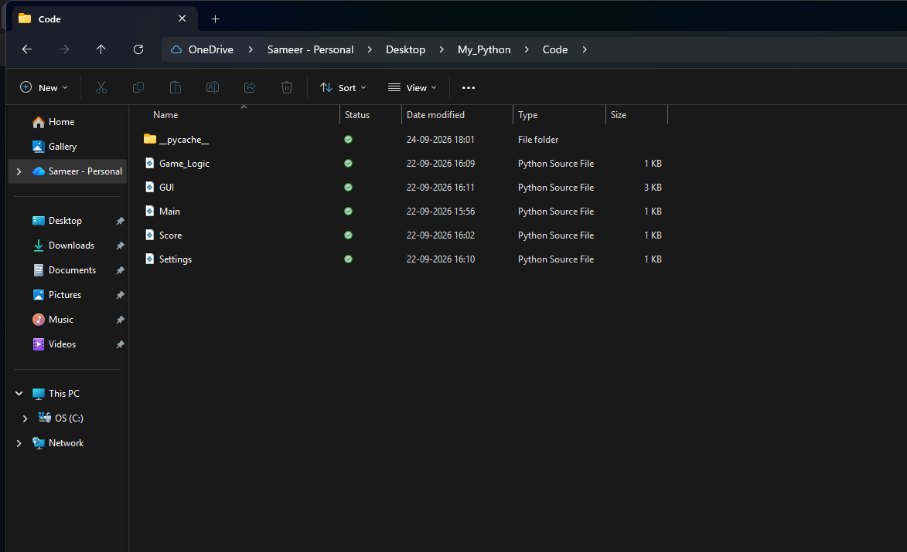
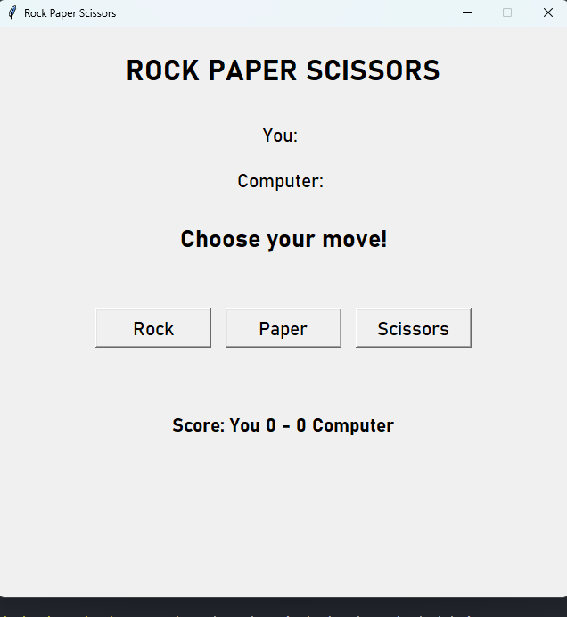
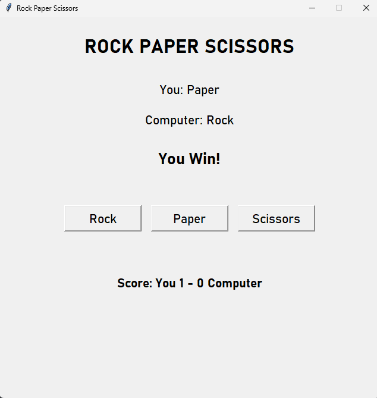
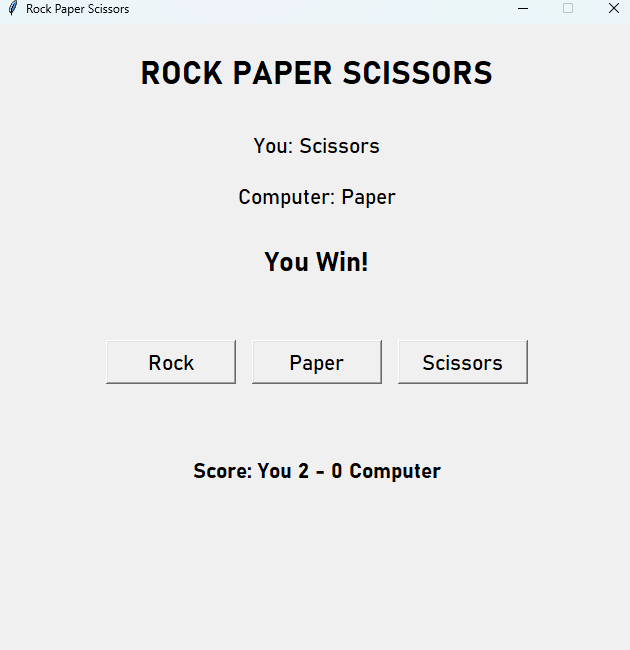
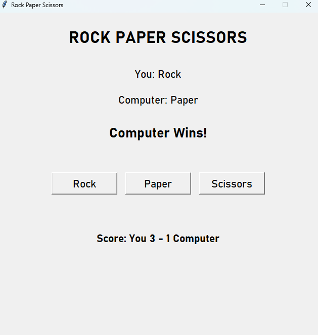

# 🪨 Rock Paper Scissor

A simple and interactive **Rock Paper Scissor** game built using **Python** and the **Tkinter** GUI library. The game allows the player to compete against the computer with a clean and easy-to-use graphical interface.

---

## 📖 Overview

**Rock Paper Scissor** is a classic hand game where the player chooses one of three options:

- 🪨 **Rock**
- 📄 **Paper**
- ✂️ **Scissor**

The computer randomly selects its choice, and the winner is determined using the standard rules:

| Player | Computer | Result |
|--------|----------|--------|
| Rock | Scissor | Player Wins |
| Paper | Rock | Player Wins |
| Scissor | Paper | Player Wins |
| Same choice | Same choice | Draw |

The project demonstrates the use of Python programming concepts along with the **Tkinter module** for creating a graphical user interface.

---

## ✨ Features

- 🎮 Interactive graphical user interface
- 🪨 Rock, Paper, and Scissor buttons
- 🤖 Computer makes a random choice
- 🏆 Automatically determines the winner
- 📊 Displays the current game result
- 🔢 Score tracking for player and computer
- 🤝 Handles draw/tie situations
- 🔄 Reset/New Game functionality
- 💻 Simple and beginner-friendly interface
- ⚡ Lightweight and runs locally
- 🖥️ Built entirely with Python and Tkinter

---

## 🛠️ Technologies / Tools Used

- **Python 3**
- **Tkinter** – Used to create the graphical user interface
- **Random module** – Used to generate the computer's choice
- **Git & GitHub** – For version control and project hosting

---

## 📁 Project Structure

```text
Rock-Paper-Scissor/
│
├── main.py              # Main game application
├── README.md            # Project documentation
└── screenshots/         # Project screenshots
    ├── home.png
    ├── gameplay.png
    └── result.png

---

## ⚙️ Installation & Setup

### 1. Install Python

Make sure **Python 3** is installed on your system.

You can check the installed version using:

```bash
python --version
```

If this command does not work, try:

```bash
python3 --version
```

---

### 2. Clone the Repository

Clone this project from GitHub using:

```bash
git clone https://github.com/SameerTheMyst/VITYarthi_Project/
```

Then open the project folder:

```bash
cd Rock-Paper-Scissor
```

---

### 3. Run the Game

Run the main Python file using:

```bash
python main.py
```

If your system uses `python3`, use:

```bash
python3 main.py
```

> **Note:** Tkinter is generally included with Python, so no additional installation is required for most systems.

---

## 🧪 Testing Instructions

Follow these steps to test the game:

1. Run the `main.py` file.
2. Select **Rock**, **Paper**, or **Scissor**.
3. Check that the computer generates a random choice.
4. Verify that the correct winner is displayed.
5. Check that the player and computer scores are updated correctly.
6. Test all possible combinations of Rock, Paper, and Scissor.
7. Select the same choice as the computer and verify that the result is a **Draw**.
8. Use the **Reset/New Game** button and check that the scores are reset.

### Expected Game Rules

```text
Rock     beats Scissor
Paper    beats Rock
Scissor  beats Paper
Same     results in Draw
```

---

## 📸 Screenshots

### 🏠 Home Screen

<!-- Replace this placeholder with your actual screenshot -->



### 🎮 Gameplay

<!-- Replace this placeholder with your actual screenshot -->








---

## 🎯 Project Objective

The main objective of this project is to create a simple GUI-based game while practicing:

- Python programming
- Functions and conditional statements
- Random choice generation
- Tkinter GUI development
- Button and event handling
- Basic project organization

---

## 🔮 Future Improvements

Some possible improvements for the project are:

- 🔊 Add sound effects
- 🎨 Add different themes
- ✨ Add animations
- 🏅 Add a best-of-5 or best-of-10 mode
- 📈 Add detailed game statistics
- 👥 Add a two-player mode

---

## 👨‍💻 Author

**Your Name**

Replace `Your Name` with your name before uploading the project to GitHub.

---

## 📄 License

This project was created for educational and learning purposes.
